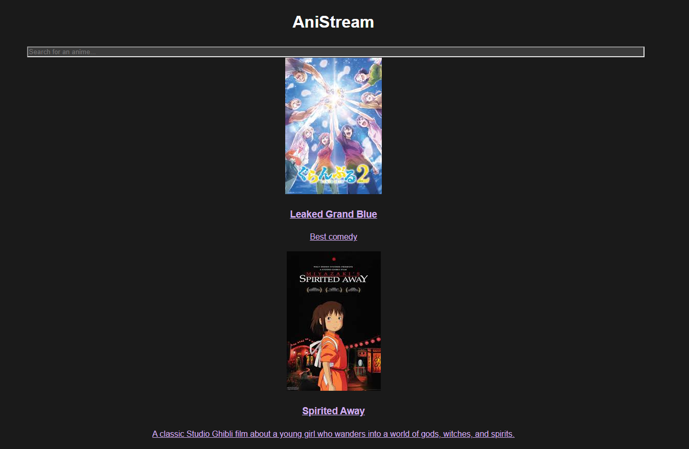
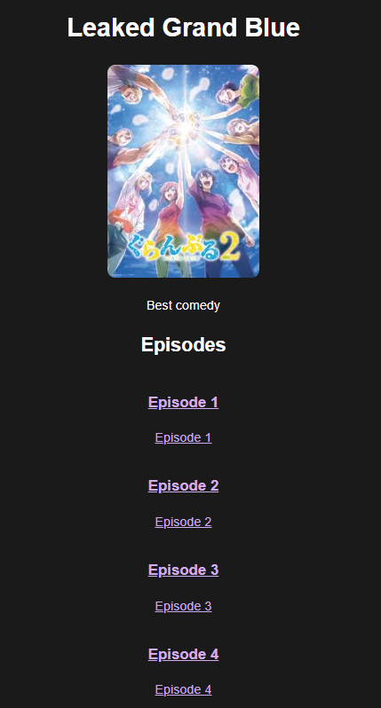
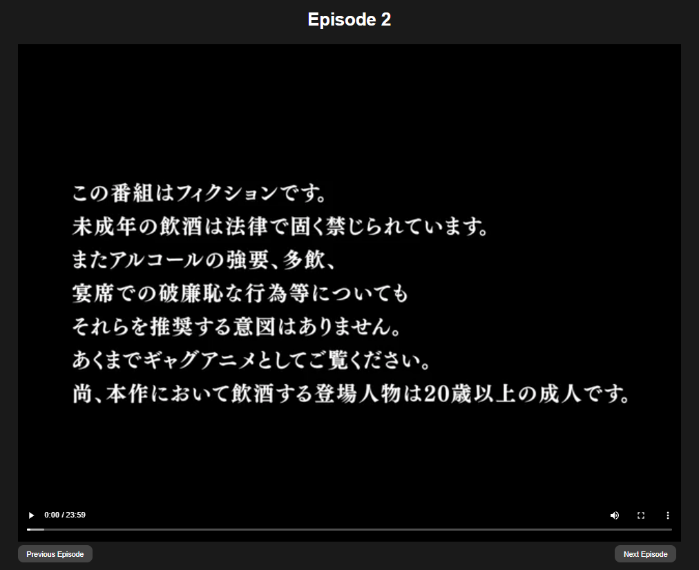
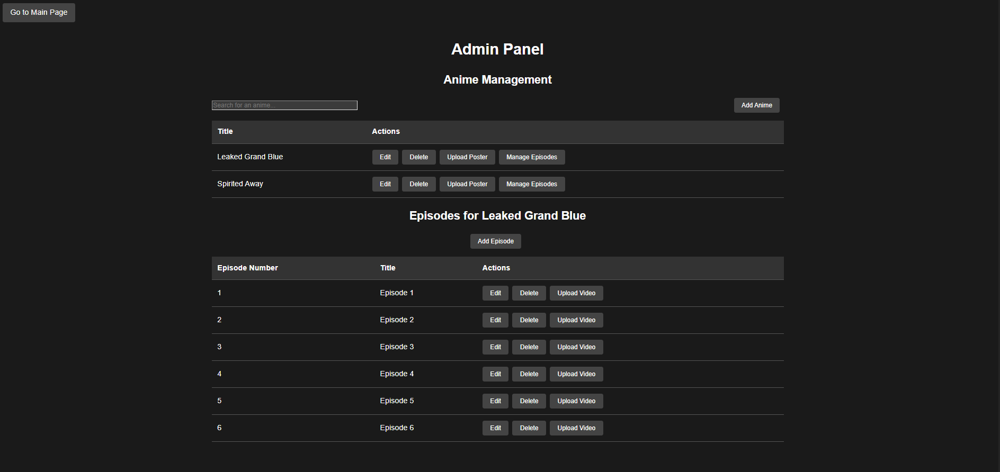

# AniStream

AniStream is a personal project I built to learn about object storage with MinIO and improve my Go skills. It's a basic anime streaming platform that demonstrates video upload, transcoding, and streaming capabilities.

This project was primarily focused on exploring MinIO for object storage and building a backend API with Go. The frontend is minimal and functional but not polished - the emphasis was on backend functionality and video processing workflows.

## Features

### Core Functionality
- Browse and search anime library
- View anime details and episodes
- Stream episodes with HLS video player
- Admin panel for content management

### Technical Implementation
- **Video Upload & Transcoding**: Upload raw videos, automatic conversion to HLS format using FFmpeg
- **Object Storage**: MinIO for storing videos, images, and transcoded content
- **Asynchronous Processing**: RabbitMQ for queuing video transcoding jobs
- **Database**: PostgreSQL with GORM for metadata storage
- **REST API**: Go backend with Gin framework

### What I Learned
- Setting up and working with MinIO object storage
- Building Go applications with proper project structure
- Implementing asynchronous job processing with RabbitMQ
- Video transcoding workflows with FFmpeg
- Basic React frontend development

## Screenshots

### Home Page

*Browse and search the anime library*

### Anime Details

*View anime information and episode list*

### Video Player

*Stream episodes with HLS video player*

### Admin Panel

*Manage anime and episodes, upload content*

## Tech Stack

### Backend (Primary Focus)
- **Go** (Golang 1.23) - Learning Go development
- **Gin** - HTTP web framework
- **GORM** - ORM for database operations
- **MinIO** - Object storage service (main learning objective)
- **RabbitMQ** - Message queue for async processing
- **FFmpeg** - Video transcoding library

### Frontend (Minimal Implementation)
- **React 19** - Basic UI components
- **Vite** - Development server
- **React Router** - Client-side routing
- **Axios** - API communication
- **Tailwind CSS** - Simple styling
- **React Player** - Video playback

### Infrastructure
- **PostgreSQL** - Database for metadata
- **MinIO** - File storage and serving
- **RabbitMQ** - Job queuing
- **Docker Compose** - Local development setup

## Architecture

The application follows a microservices-like architecture with separate components:

1. **API Server** (`cmd/main.go`) - Main REST API server
2. **Worker** (`cmd/worker/main.go`) - Background video transcoding service
3. **Frontend** - React SPA for user interface

### Data Flow
1. Admin uploads raw video file via API
2. File is stored in MinIO "raw-videos" bucket
3. Transcoding job is queued in RabbitMQ
4. Worker processes the job, transcodes to HLS, stores in MinIO
5. Database is updated with video metadata
6. Users can stream the HLS content

## Project Structure

```
anistream/
├── cmd/
│   ├── main.go          # API server entry point
│   └── worker/
│       └── main.go      # Worker entry point
├── internal/
│   ├── config/          # Configuration management
│   ├── db/              # Database connection
│   ├── handlers/        # HTTP handlers
│   ├── minio/           # MinIO client
│   ├── models/          # Database models
│   ├── rabbitmq/        # RabbitMQ client
│   ├── router/          # Route definitions
│   ├── services/        # Business logic (placeholder)
│   └── worker/          # Transcoding logic
├── frontend/            # React application
│   ├── src/
│   │   ├── components/  # Reusable UI components
│   │   ├── pages/       # Page components
│   │   └── lib/         # Utilities
│   └── ...
├── docker-compose.yml   # Local development setup
├── go.mod
└── README.md
```

## Setup and Installation

### Prerequisites
- Go 1.23+
- Node.js 18+
- Docker and Docker Compose
- FFmpeg (for video transcoding)

### Local Development Setup

1. **Clone the repository**
   ```bash
   git clone <repository-url>
   cd glowing-octo-chainsaw
   ```

2. **Start infrastructure services**
   ```bash
   docker-compose up -d
   ```

3. **Configure environment variables**
   ```bash
   cp .env.example .env
   # Edit .env with your configuration
   ```

4. **Setup backend**
   ```bash
   go mod download
   go run cmd/main.go
   ```

5. **Setup frontend** (in another terminal)
   ```bash
   cd frontend
   npm install
   npm run dev
   ```

6. **Start worker** (in another terminal)
   ```bash
   go run cmd/worker/main.go
   ```

The application will be available at:
- Frontend: http://localhost:5173
- API: http://localhost:8080
- MinIO Console: http://localhost:9001
- RabbitMQ Management: http://localhost:15672

## API Endpoints

### Anime
- `GET /api/anime/` - List all anime
- `GET /api/anime/:id` - Get anime details with episodes
- `POST /api/admin/anime/` - Create anime (admin)
- `PUT /api/admin/anime/:id` - Update anime (admin)
- `DELETE /api/admin/anime/:id` - Delete anime (admin)

### Episodes
- `GET /api/episodes/:id` - Get episode details
- `POST /api/admin/episodes/` - Create episode (admin)
- `PUT /api/admin/episodes/:id` - Update episode (admin)
- `DELETE /api/admin/episodes/:id` - Delete episode (admin)
- `POST /api/admin/episodes/:id/upload` - Upload video file (admin)

### Media
- `GET /api/stream/:episodeId/master.m3u8` - Get HLS playlist
- `GET /api/stream/:episodeId/segment/:segmentFile` - Get HLS segment
- `GET /posters/:animeId/:posterFile` - Get poster image
- `POST /api/admin/anime/:id/poster` - Upload poster (admin)

## Usage

### For Users
1. Visit the homepage to browse available anime
2. Use the search bar to find specific titles
3. Click on an anime card to view episodes
4. Click on an episode to start streaming

### For Administrators
1. Navigate to `/admin` to access the admin dashboard
2. Add new anime entries with title, description, and release year
3. Upload poster images for anime
4. Create episodes and upload video files
5. Monitor transcoding progress

## Development

### Running Tests
```bash
go test ./...
```

### Building for Production
```bash
# Backend
go build -o bin/server cmd/main.go
go build -o bin/worker cmd/worker/main.go

# Frontend
cd frontend
npm run build
```

### Code Quality
- Backend: Uses standard Go formatting (`go fmt`)
- Frontend: ESLint configuration included

## Future Improvements

This was a learning project, but there are many potential enhancements listed in [IMPROVEMENTS.md](IMPROVEMENTS.md). Some ideas include:
- User authentication and profiles
- Better search and filtering
- Genre categorization
- Subtitle support
- Improved UI design
- Production-ready logging and configuration

## About This Project

This project helped me understand:
- How object storage works with MinIO
- Building REST APIs with Go and Gin
- Asynchronous job processing with RabbitMQ
- Video transcoding pipelines
- Full-stack application architecture

The UI is intentionally minimal - the focus was on backend functionality and learning new technologies rather than frontend design.